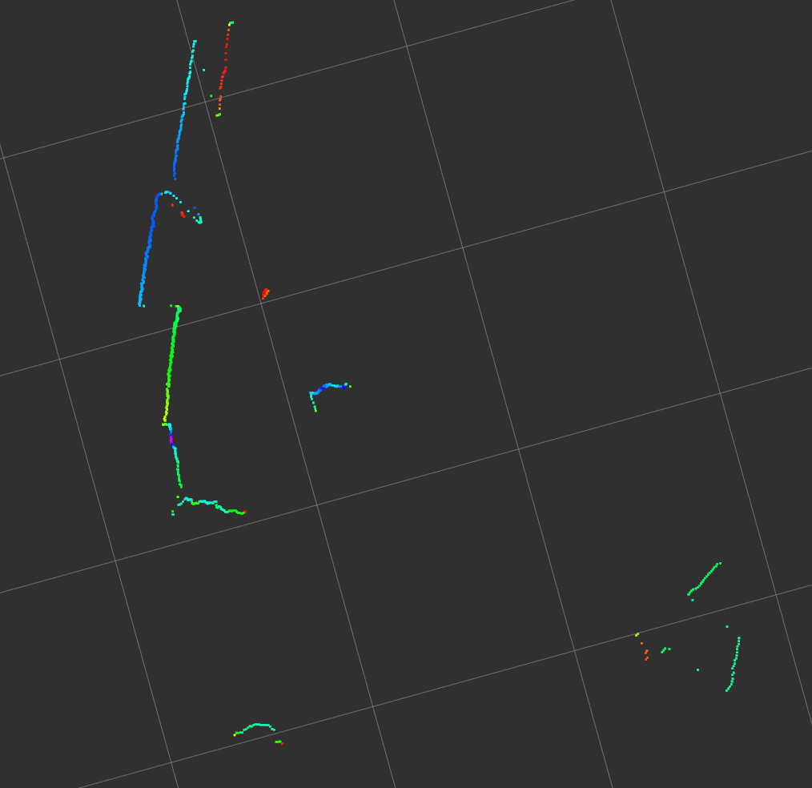

### Ubuntu16.04 UTM-30LX Gige驱动笔记

#### 1.创建相关工作空间和urg_node

安装laser_proc和urg_c

```
 cd ~/catkin_ws/src
 git clone https://github.com/ros-perception/laser_proc.git
 git clone https://github.com/ros-drivers/urg_c.git
 cd ~/catkin_ws
 catkin_make
```

安装urg_node

```
 cd ~/catkin_ws/src
 git clone https://github.com/ros-drivers/urg_node
 cd ~/catkin_ws
 catkin_make
 catkin_make install
```

#### 2.设置IP地址

UTM30-LX-EW激光的初始IP地址：192.168.0.10

保证当前设备的IP地址与其在同一个网段即可

### 3.启动URG

```
roscore
rosrun urg_node urg_node _ip_address:=192.168.0.10
```

终端显示Streaming data即表明正常数据采集

#### 4.在Rviz中可视化

Add Topic：

**/scan LaserScan**

将Frame名称修改为**laser**

即可在Rviz中看到采集到的点云

