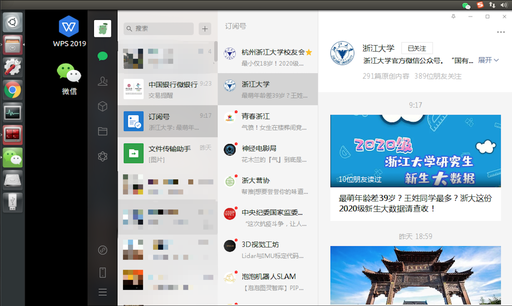

## 如何在ubuntu16.04中借助wine安装wechat

假设安装前无wine和winetricks，最终效果是可以在ubuntu16.04中使用wechat，但是文件和图片的发送依然存在问题。正常大小的文件和图片难以被发送，但是文件和图片的接收没有问题。



### 1.安装wine5.0

1.启用32位体系结构:

```
sudo dpkg --add-architecture i386 
```

2.下载并添加存储库密钥:

```
wget -O - https://dl.winehq.org/wine-builds/winehq.key | sudo apt-key add - 
```

3.添加存储库（按照ubuntu的版本执行相应的命令:

```
sudo add-apt-repository 'deb https://dl.winehq.org/wine-builds/ubuntu/ xenial main'
```

4.更新软件源[如果翻墙会更快]:

```
sudo apt-get update
```

5.安装wine5.0 稳定版本[如果翻墙会更快]：

```
sudo apt-get install winehq-stable
```


检查安装

```
wine --version

wine-5.0.2
```


### 2.安装winetricks

1.获取新版本

```text
wget  https://raw.githubusercontent.com/Winetricks/winetricks/master/src/winetricks
```

2.修改权限

```text
chmod +x winetricks
```

3.移动至可调用目录

```text
sudo mv -v winetricks /usr/local/bin
```


### 3.配置Wine bottle

Wine bottle 可以理解为都是一个**微型的隔离的**虚拟机。

1.新建一个文件目录

```text
mkdir Wine
cd Wine
```

2.初始化config [如果自动安装的部分可以取消]

```text
WINARCH=win32 WINEPREFIX=/home/frank/Wine/WeChat winecfg
```

取消两步自动安装后会出现一个界面，该界面的语言与终端的语言有关。

3.通过winetricks添加以来项目

```text
WINARCH=win32 WINEPREFIX=/home/frank/Wine/WeChat winetricks
```

会出现选择界面 =>选择默认的Wine容器=>安装Windows DLL组件=>勾选riched20.dll

**等待安装完成..**[安装过程中可能会有各种提示报错，但是一律OK即可]

4.通过config界面确认库的安装

```text
WINARCH=win32 WINEPREFIX=/home/frank/Wine/WeChat winecfg
```

在界面中的库中，应该有riched20 和 riched32（我额外添加的），如果没有的话，需要手动添加。


### 4.安装

将微信安装程序放置于Wine目录

```text
WINARCH=win32 WINEPREFIX=/home/xxxx/Wine/WeChat wine WeChat_C1018.exe
```

安装微信，应该会跳出安装界面...直接安装即可


### 5.中文配置

##### 1.微信不能发送截图

缺少相关库，通过apt-get安装

```
sudo apt-get install libjpeg62:i386
```


##### 2.文本框不能发送中文

rished20.dll是用于输入法的库，在winetricks的配置时需要进行安装。

1.保证在winecfg中，函数库中已经配置rished20

2.命令行输入 winetricks riched20 ，重启重新打开微信


##### 3.中文方块问题和中文输入法无效问题

在桌面的快捷启动程序中配置环境变量，打开桌面的 微信.desktop(wechat.desktop)

修改内容，在Exec中加入  env LANG=zh_CN.UTF-8 (解决中文方块问题)

加入 GTK_IM_MODULE="fcitx" QT_IM_MODELE="fcitx" XMODIFIERS="@im=fcitx" （解决中文拼音无法输入问题）

**示例如下：**

```
[Desktop Entry]
Name=微信
Exec=env LANG=zh_CN.UTF-8 GTK_IM_MODULE="fcitx" QT_IM_MODULE="fcitx" XMODIFIERS="@im=fcitx" WINEPREFIX="/home/qk/Wine/WeChat" wine C:\\\\windows\\\\command\\\\start.exe /Unix /home/qk/Wine/Wechat/dosdevices/c:/users/Public/Desktop/微信.lnk
Type=Application
StartupNotify=true
Path=xxx
Icon=xxx
StartupWMClass=xxx
```


##### 4.中文字体无法正常显示的问题 

在 Wine/Wechat/drive_c/windows/Fonts中增加相关字体即可，所需的字体可以在网上进行下载。

这里提供一个百度网盘链接，里面有常用的字体。

链接:https://pan.baidu.com/s/1QonvTqw9iRbdyZedc2Mhow  密码:fa20


**最后ubuntu桌面会存在一个快捷启动方式，直接使用桌面的.desktop进行快捷启动即可。**

